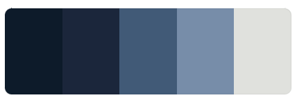

# Color

I chose these combination of colors for this page to inbue the viewer with a sense of calm, seriousness and sophistication. They also differ enough to create a good contrast. I have also used a slightly grey color for the text to reduce eye strain.

The colors are the following:
- Background-color: #0d1b2a; 
- Section-1-bg-color: #1b263b; 
- Section-2-bg-color: #415a77; 
- Section-3-bg-color: #778da9;
- Text-color: #e0e1dd;

## Favicon

I used <a href="https://realfavicongenerator.net/" target="_blank" rel="noopener noreferrer">RealFavicon Generator</a> to create a favicon images for my website for all devices.

